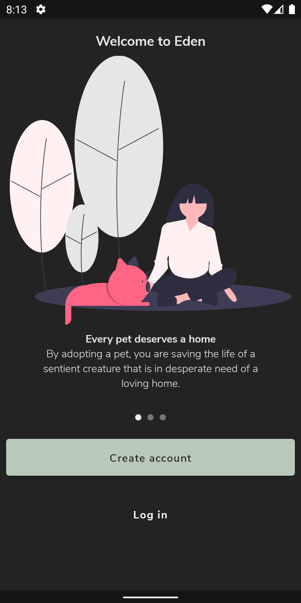
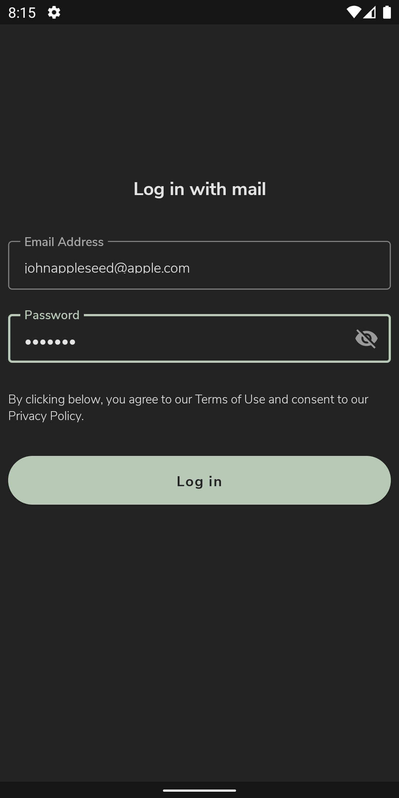
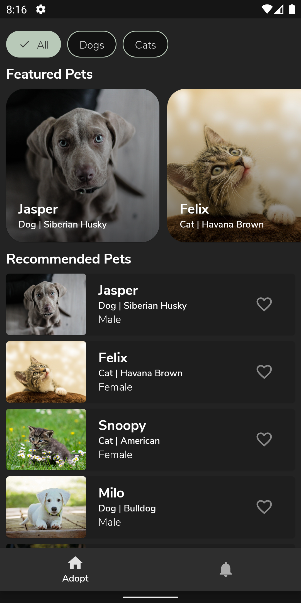
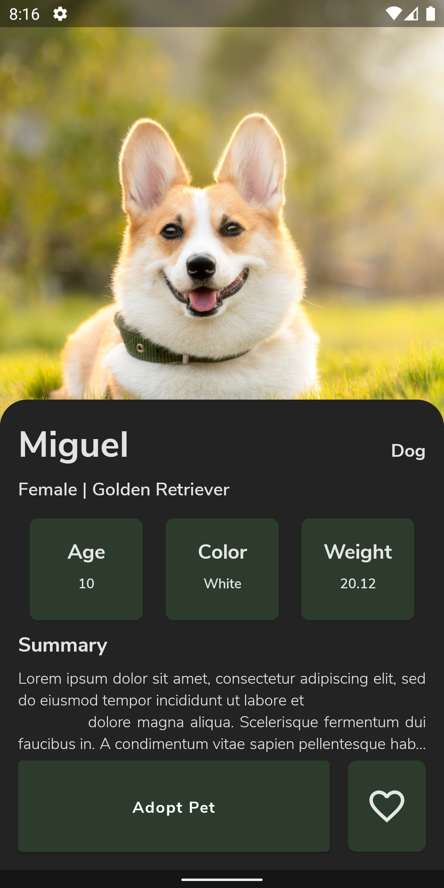
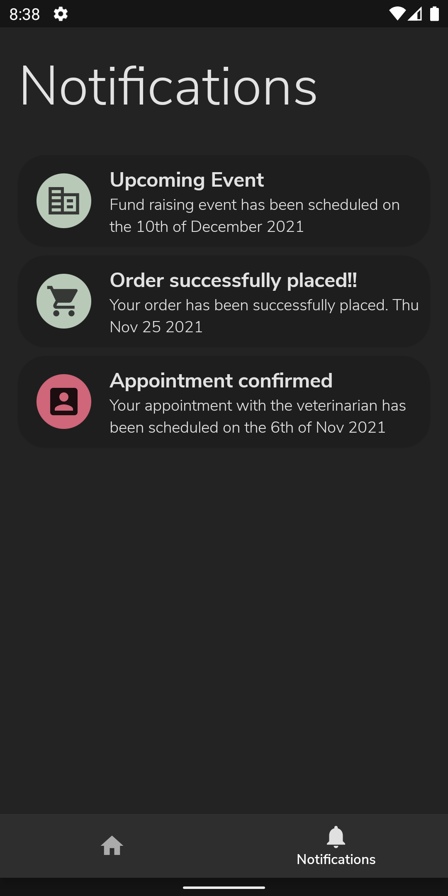

# Eden - A pet adoption app 🐶 

Eden is a pet adoption app that demonstrates the use of [Jetpack Compose](https://developer.android.com/jetpack/compose?gclid=EAIaIQobChMI15Hjt8u29AIVGpNmAh0-MwGYEAAYASAAEgLQe_D_BwE&gclsrc=aw.ds) with a typical Android app.  
To try out this sample app, you need to use [Android Studio Arctic Fox](https://developer.android.com/studio).
## Table of contents
- [Screenshots](#screenshots)
- [Tech stack](#tech-stack)
- [Source code and architecture](#source-code-and-architecture)
## Screenshots
 &nbsp; &nbsp;  &nbsp;  &nbsp;  
## Tech Stack
- Entirely written in [Kotlin](https://kotlinlang.org/).
- Manual dependency injection.
- [Jetpack Compose](https://developer.android.com/jetpack/compose) for the entire UI.
- [Coroutines](https://kotlinlang.org/docs/reference/coroutines/coroutines-guide.html) for
  threading.
- [Timber](https://github.com/JakeWharton/timber) for logging.
- [Firebase Authentication](https://firebase.google.com/docs/auth) for user account creation and authentication.
- [Firebase cloud storage](https://firebase.google.com/products/storage?gclid=EAIaIQobChMI0Nvz9M629AIVSyQrCh2FAA0rEAAYASAAEgLryvD_BwE&gclsrc=aw.ds) for storing
images
- [Accompanist library](https://google.github.io/accompanist/) for compose insets and pager layouts.
- [Lottie](https://airbnb.io/lottie/#/README) for animations.
- [Coil-compose](https://coil-kt.github.io/coil/compose/) for image loading.
## Source code and architecture
- [Architecture components](https://developer.android.com/topic/libraries/architecture/) such as Livedata and ViewModels are used.
- [MVVM](https://developer.android.com/jetpack/guide?gclid=EAIaIQobChMI-_GIsejG8QIVzNaWCh0NXQANEAAYASAAEgKZ2fD_BwE&gclsrc=aw.ds)
  architecture.
- Source code conforms to
  the [Kotlin coding conventions](https://kotlinlang.org/docs/coding-conventions.html).
- Dependency injection is done manually.
- [Material design color system](https://material.io/design/color/the-color-system.html#color-usage-and-palettes)
  specification is used for assigning colors to the UI components.
- Commit messages follow the [Conventional Commits specification](https://www.conventionalcommits.org/en/v1.0.0/).
